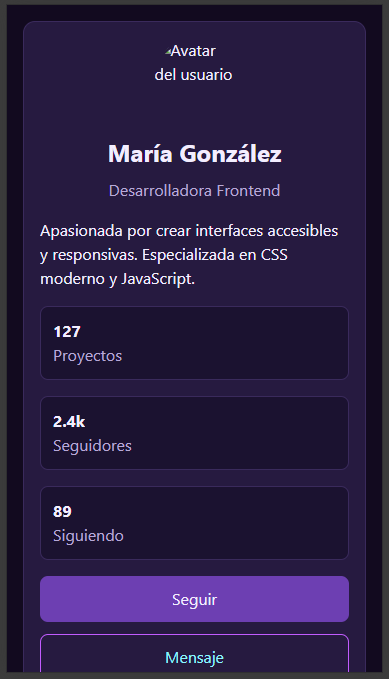
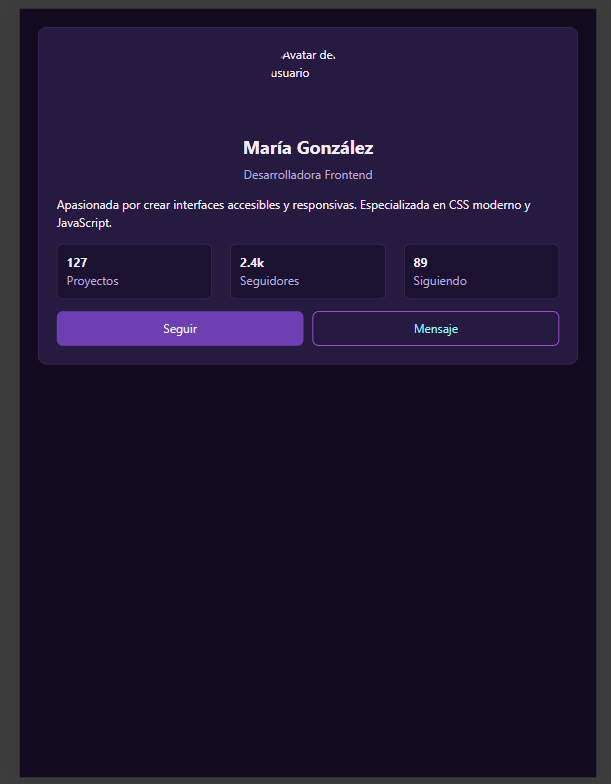
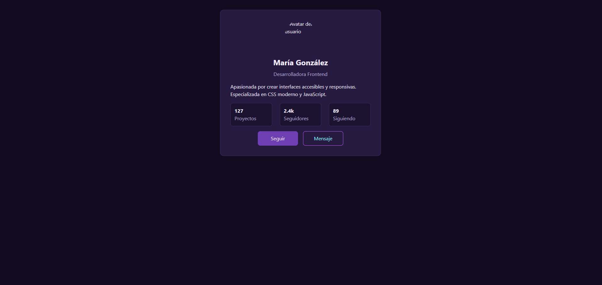

# FS3.0-PI-M3

## Inicializacion de la app

Abrir el archivo index.html en el navegador de forma directa o con una extension como LiveServer

## Checklist de auto-verificación

### Mobile (320px)

- [x] Sin scroll horizontal
- [x] Tipografía legible (body 16px mínimo)
- [x] Botones táctiles (min 44px)
- [x] Avatar visible y bien dimensionado
- [x] Stats apilados verticalmente

### Tablet (768px)

- [x] Más padding visible
- [x] Stats en fila horizontal
- [x] Media query activa en DevTools
- [x] Transición suave desde mobile

### Desktop (1024px)

- [x] Tarjeta centrada
- [x] max-width aplicado
- [x] No ocupa todo el ancho
- [x] Legible y con buen espaciado

### General

- [x] Meta viewport presente
- [x] CSS organizado (base → 768 → 1024)
- [x] Unidades relativas (rem para spacing)
- [x] No hay código duplicado innecesario
